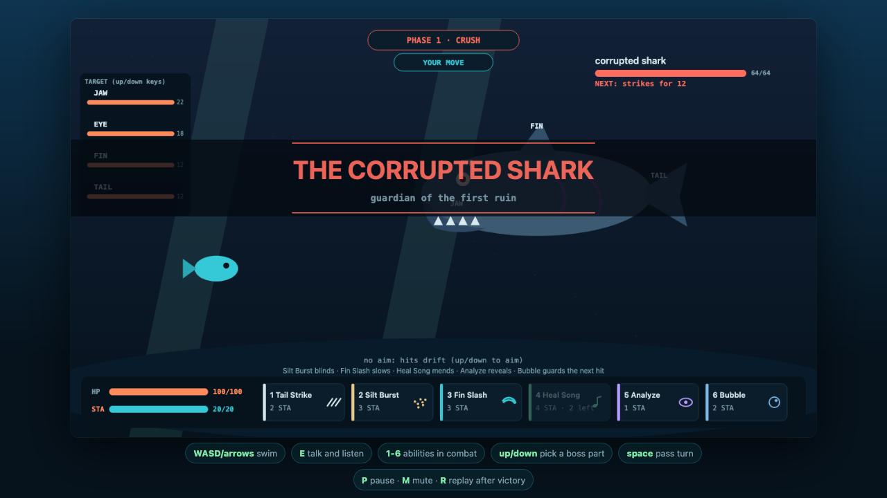
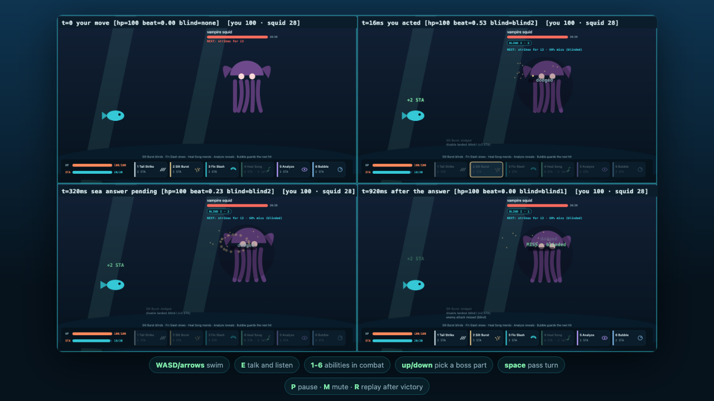
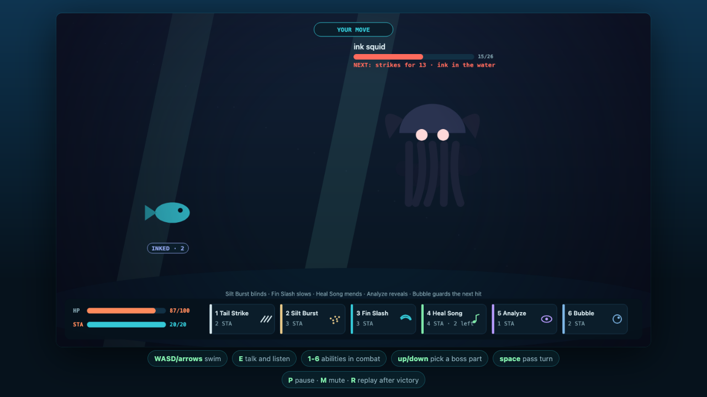

# TIDESONG (working title)

**▶ PLAY NOW: https://immortaldemongod.github.io/tidesong/**



An overnight TypeScript vertical slice of Team Ratateam's Underwater Jam
project, built to test the merged design (Marc's proposal + Glass_Goat's
combat system) before the jam starts Jul 30. Not the final game and not
the final engine (the merge proposal left Unity vs Godot vs web open) --
a playable answer to "is this design fun enough to build?" See
`DESIGN.md` for every rule and logged amendment, `PROGRESS.md` for the
build log, exit gates, and the honest morning report.

## How to run

**In your browser (nothing to install):**
https://immortaldemongod.github.io/tidesong/

**Offline:** download `dist/index.html` and double-click it -- one
self-contained ~69KB file, no dependencies, no server.

**Dev way** (only needed to modify the game):
```bash
# install bun once: https://bun.sh  (curl -fsSL https://bun.sh/install | bash)
bun test          # run the 93 bot playtests (267k assertions)
bun build.ts      # rebuild dist/index.html
open dist/index.html
```
No node_modules, no package install -- the game has zero dependencies;
bun is just the TypeScript runner/bundler.

**Note for teammates:** this branch (`overnight-build`) carries the whole
prototype; `main` is a bare README. Grab `dist/index.html` if you just
want to play.

## The pitch

You are a small fish returning the sea's lost song. Combat is turn-based
and disable-first, and every enemy TELEGRAPHS: the intent line shows the
incoming strike, the heavy windup (every 3rd blow lands 1.6x -- Bubble
it, or Slow it away), the miss chance your silt bought, and what changes
if the boss part you are aiming at breaks. Regular enemies take
conditions; bosses are limb puzzles with phases (the eel's weak part
wanders every run; Analyze finds it; the ink squid blinds YOU back).
Journey: hub reef → merfolk and memory fragments → song-seal stone
puzzle → first ruin → the corrupted shark → Tide Relic parts the
current wall → second ruin → the corrupted eel → the sea's name spills
loose, and you decide whether to sing it back or let it go. The verses
you gathered are the song you have to sing with.

## Structure

- `src/game.ts` -- pure combat sim: no DOM, no timers, seeded RNG.
  Conditions, limb targeting, phases, the heavy cycle, enemy intent.
- `src/world.ts` -- pure world sim: hub, dungeons, fragments, the
  song-seal puzzle, the death/mercy rules. Bots drive both directly.
- `src/render.ts` -- 2.5D canvas renderer (parallax, depth fog, staged
  combat), pure function of state.
- `src/main.ts` -- browser shell: input, the turn beat, story cards,
  banners, `?demo=` / `?filmstrip=` hooks.
- `src/events.ts` + `src/audio.ts` -- pure log-line classifier feeding a
  WebAudio synth: per-ability voices, mood-aware music that gains a
  harmony voice per collected fragment.
- `test/` -- 93 bot playtests: pinned judge bots, difficulty bands with
  anti-overfit guards, full-run clears, 32k-action fuzz, telegraph
  honesty property tests.
- `build.ts` -- bundles everything into `dist/index.html`.

## Verification

- 93/93 tests green (267,765 assertions); 25x consecutive soak clean.
- Scripted full-run bot clears 50/50; casual bot 100/100, and
  5,000/5,000 at scale with zero failure seeds.
- Difficulty bands hold on 100,000 fresh-seed fights (20k per encounter)
  disjoint from every tuning seed.
- Telegraph honesty property-tested and pixel-verified as played: what
  the intent line announces is what lands, including heavy windups,
  phase breaks, and part breaks.
- Three adversarial panel rounds plus seven human-profile playthroughs
  drove ~90 logged fixes; the final panel and confirmations closed at
  zero high-severity findings.
- Nine-minute continuous browser session: flat 9.5MB heap, one live
  interval, locked 60fps, zero errors (Firefox and Chromium verified).

## Query params (testing hooks)

`?demo=combat|boss|boss2|bossp2|bossintro|ink|victory|dungeon1|dungeon2|talk|fragment|doorcard|trench|pause|defeat|explore`
canned states for screenshots · `?filmstrip=combat|kill|click` as-played
strips with measured labels (real key/pointer events on a virtual clock).

## The exchange as played





All names are placeholders. All art, style, and character design:
Glass_Goat (everything visual here is a placeholder skeleton). Design
and story: Marc (all verses are marked drafts). Code: ImmortalDemon.
